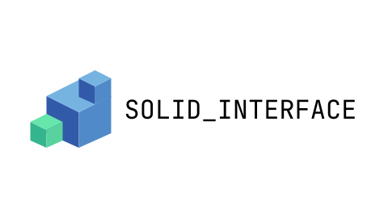

# Solid Interface

Solid Interface is a components library to build your accessible [SolidJS](https://www.solidjs.com/) components.

> ⚠️ This library is still in development and is not ready for production.

## Concepts

- 📦 **Small**: The library is small and tree-shakeable.
- 🚹 **Accessible**: The components are accessible by default.
- 🤸‍♀️ **Flexible**: The components are styleless by default, so you can style them as you want!
